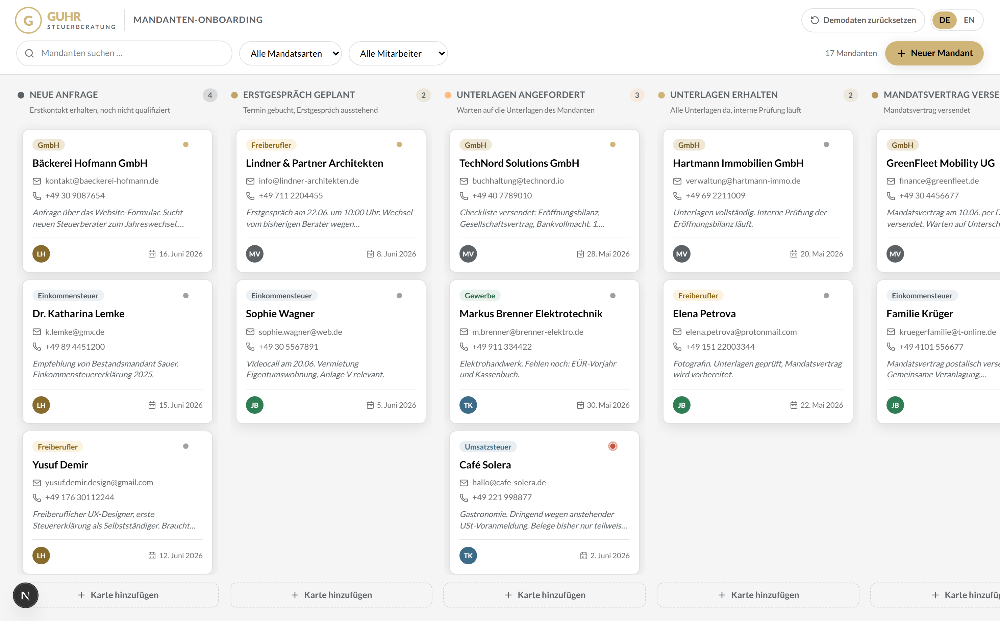

# Guhr Onboarding-Board

A Kanban-style CRM board for the **client onboarding process of a tax-advisory firm**,
built specifically for [Guhr Steuerberatung](https://guhr-steuerberatung.de) — bilingual
(Deutsch / English), drag-and-drop, and branded to match the firm's website.

> Trial project — AI Automation Engineer @ Guhr Steuerberatungsgesellschaft mbH.


<!-- Add a screenshot at docs/screenshot.png (or replace this with a Loom link). -->

---

## What it does

- **Seven onboarding phases** tailored to a Steuerberatung: Neue Anfrage → Erstgespräch
  geplant → Unterlagen angefordert → Unterlagen erhalten → Mandatsvertrag versendet →
  Aktiv & Mandatiert → Pausiert.
- **Rich client cards** showing everything at a glance: name, email, phone, mandate type
  (Einkommensteuer, GmbH, Freiberufler, …), assigned team member, date added, a priority
  color indicator, and a notes / next-steps preview.
- **Smooth drag & drop** between and within columns — no page reload, keyboard-accessible.
- **Full detail view**: click any card to edit every field, change phase/priority/assignee,
  or delete it.
- **Add a card directly in any column** via an inline quick-add.
- **Search & filter** by client name, mandate type, or team member — so the board stays
  usable as it fills up.
- **Bilingual**: German by default with a one-click DE ⇄ EN toggle (the firm's staff are
  German; reviewers can switch to English).
- **Persistent**: the board state is saved to the browser (localStorage) and survives
  reloads. A "Demodaten zurücksetzen" button restores the seeded demo board.
- **On-brand**: the verified Guhr gold (`#d0b578`), Lato typography, soft 10 px-radius
  cards and pill buttons — it reads as *Guhr's* internal tool, not a generic SaaS board.

---

## Quick start

```bash
# Requirements: Node 20+ and npm
npm install
npm run dev          # → http://localhost:3000
```

Other scripts:

```bash
npm run build        # production build
npm start            # serve the production build
npm test             # run the unit tests (Vitest)
npm run lint         # eslint
```

No environment variables or backend setup needed — it runs entirely in the browser with
seeded demo data.

---

## Tech stack & why

| Choice | Why |
|---|---|
| **Next.js 16 (App Router) + React 19 + TypeScript** | A first-class, well-supported stack that deploys to Vercel with one click. TypeScript keeps the domain model (cards, phases, mandate types) honest end-to-end. The board itself is a client component — Next gives us a clean, production-grade shell around it. |
| **Tailwind CSS v4** | The entire Guhr brand is encoded once as design tokens (`@theme` in `globals.css`) and reused everywhere, so the look stays consistent and on-brand by construction. No JS config. |
| **@dnd-kit** (core + sortable) | Accessible (pointer **and** keyboard), smooth, dependency-light, and actively maintained — unlike the deprecated `react-beautiful-dnd`. Its multi-container sortable model fits a Kanban board exactly. |
| **lucide-react** | Thin line icons that match the line-icon style on the Guhr website. |
| **localStorage behind a `BoardRepository` interface** | Zero-setup persistence so the app is genuinely "runnable locally", while the interface means swapping in a real database (e.g. Supabase) later is a one-file change — no UI rewrite. |
| **Vitest** | Fast unit tests for the one part that genuinely deserves them: the pure board reducer (move / add / edit / delete / reorder). |

**Design philosophy:** keep the state logic pure and testable (`src/lib/board.ts`), keep the
persistence swappable (`src/lib/storage.ts`), and keep the UI a thin, well-bounded layer of
small components on top. Every file does one thing.

---

## How it's built (architecture)

```
src/
  app/            layout (Lato + LocaleProvider + metadata), page, globals.css (brand theme), icon.svg
  lib/
    types.ts      domain types — the single source of truth
    brand.ts      verified Guhr color tokens (for data-driven inline styles)
    constants.ts  phases, mandate types, priorities, team roster, storage keys
    colors.ts     contrast / alpha helpers
    i18n.ts       typed DE/EN dictionaries (same shape → compile-time completeness)
    board.ts      PURE reducer: add / update / delete / move / reorder / filter  ← unit-tested
    storage.ts    BoardRepository interface + localStorage implementation
    seed.ts       17 realistic demo clients across all phases & mandate types
    format.ts     timezone-stable date formatting + id generation
    board.test.ts Vitest
  components/
    LocaleProvider.tsx   locale context + persistence + useT()
    Board.tsx            the spine: DnD context, state, persistence, filtering, modal
    BoardHeader.tsx      logo, search, filters, language toggle, reset, new-client
    Column.tsx           droppable phase column + inline add + empty/filtered states
    ClientCard.tsx       draggable compact card (+ presentational view for the drag overlay)
    CardDetailModal.tsx  accessible dialog: full edit / delete
    AddCardForm.tsx      inline quick-add
    LocaleToggle.tsx
    ui/  Logo · Avatar · MandateBadge · PriorityDot
```

**Data flow:** `Board` loads state through `BoardRepository` on mount, holds the `BoardState`,
and routes every mutation through the pure functions in `board.ts`; changes are debounce-saved
back to storage. Drag-and-drop events map to `moveCard` / `reorderWithinPhase`. Search and
filters are derived views — they never mutate the underlying data.

---

## Branding — matched to guhr-steuerberatung.de

The brand tokens were taken directly from the firm's live site (Elementor global CSS + logo):

- **Gold `#d0b578`** as the single accent (logo, buttons, links, active states, drag highlight).
- **Lato** everywhere (headings 700, body 400) — the firm's typeface, self-hosted via `next/font`.
- Headings in black `#000`, body in soft gray `#797979`; white cards with `10px` radius and the
  site's exact `0 4px 20px rgba(0,0,0,.1)` shadow; pill (`25px`) gold buttons.
- The verified brand **green `#15be7d`** is reused for the "Aktiv & Mandatiert" phase.

Mandate badges and per-phase column accents use a small, muted palette derived from these tokens
so the board has helpful color-coding without ever leaving the brand.

One deliberate, accessibility-driven deviation: the firm's site uses **white** text on gold
buttons (≈2:1 contrast). For a daily-use internal tool aimed at non-technical staff, this app
uses **dark** text on the gold buttons instead (≈10:1) — the gold brand identity is fully
preserved, but the most-pressed controls stay easily legible. Text/badge/contrast tokens were
tuned to clear WCAG AA throughout.

---

## How I worked (workflow & AI tooling)

- **Started from the brief, not the keyboard.** I clarified the few decisions that actually
  shape the deliverable (framework, persistence, language, deployment) before writing any code,
  and wrote a short design spec (`docs/superpowers/specs/`).
- **Verified the brand instead of guessing it.** Rather than eyeball the colors, I extracted the
  real design tokens from the live Guhr site's CSS and the logo SVG, so the match is exact.
- **AI-assisted with [Claude Code](https://claude.com/claude-code) (Opus).** I used it to research
  the brand, scaffold the project, and write the implementation, then reviewed and verified the
  result (build + unit tests + a multi-perspective code review). Because the installed Next.js
  was a newer major (16) than the model's training data, I had it read the version-matched docs
  bundled in `node_modules/next/dist/docs/` before writing code — so the App Router, fonts, and
  Tailwind v4 setup follow current conventions, not stale ones.
- **Kept the risky part honest with tests.** The board reducer is pure and covered by Vitest, so
  drag-and-drop reordering behaves correctly in every direction and across columns.

## How long it took

Roughly **a single focused half-day** of AI-assisted work end to end: ~30 min on
requirements + brand research, the bulk on implementation, and the remainder on review,
tests, and this write-up.

## What I'd add with more time

- **Real backend & multi-user** — swap the `BoardRepository` for Supabase (Postgres + Auth +
  Realtime) so the team shares one live board. The interface is already in place for this.
- **Activity log & timestamps** — "moved to phase X on …", last-contacted, and document-checklist
  state per card (very relevant to a real onboarding).
- **Due dates & reminders** — e.g. follow-up on "Unterlagen angefordert" after N days.
- **Optimistic toasts & undo** for moves and deletes.
- **E2E tests** (Playwright) for the drag-and-drop interactions, plus component tests for the modal.
- **More brand polish** — replace the reconstructed logo with the firm's official SVG, and add the
  firm's real team roster.

---

## Deployment

The app is a Next.js project and deploys to **Vercel** with no configuration:

1. Push this repo to GitHub.
2. Import it at [vercel.com/new](https://vercel.com/new) (framework auto-detected as Next.js).
3. Deploy — no environment variables required.

---

_Built as a trial project. Not affiliated with or endorsed by Guhr Steuerberatungsgesellschaft mbH
beyond this exercise; brand assets are used solely to demonstrate a faithful visual match._
